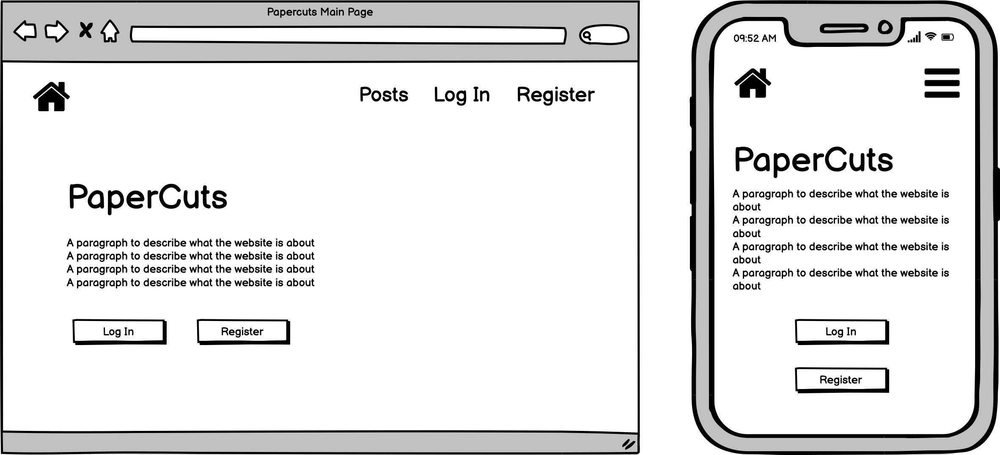
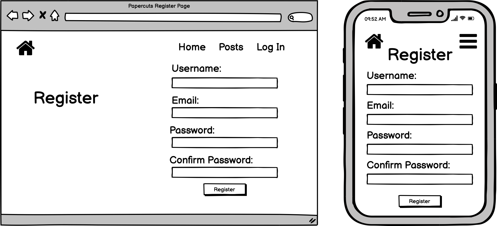
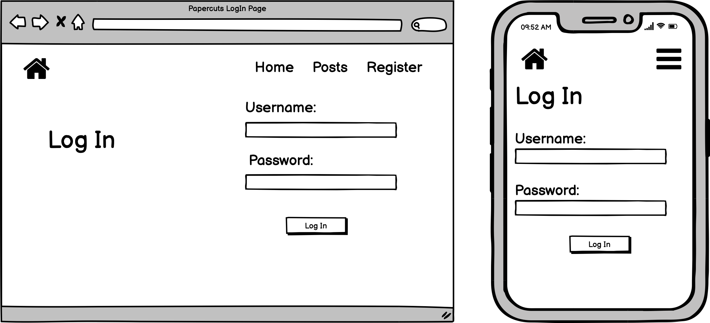
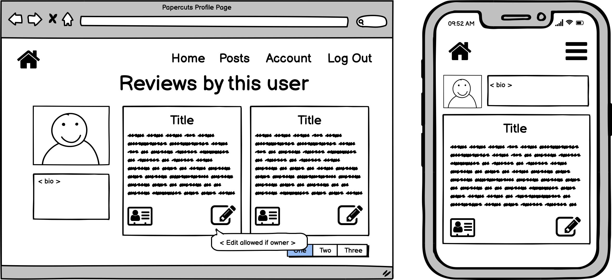
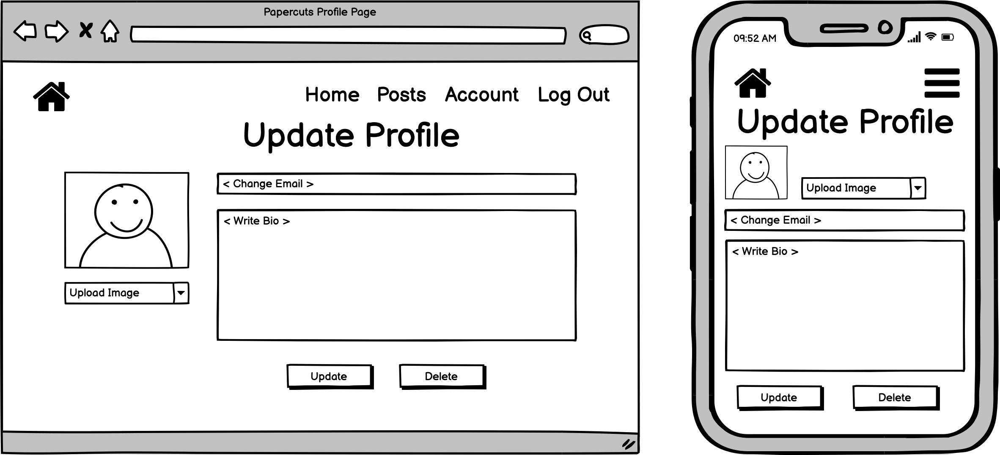
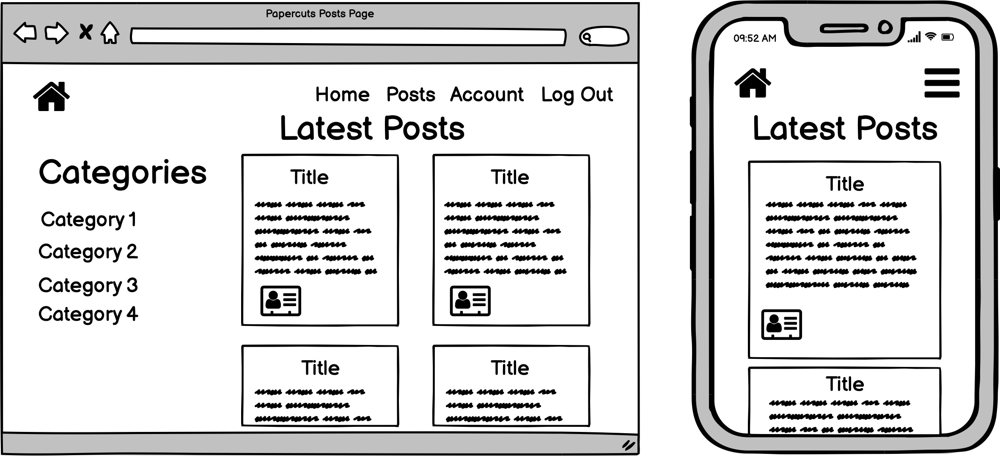
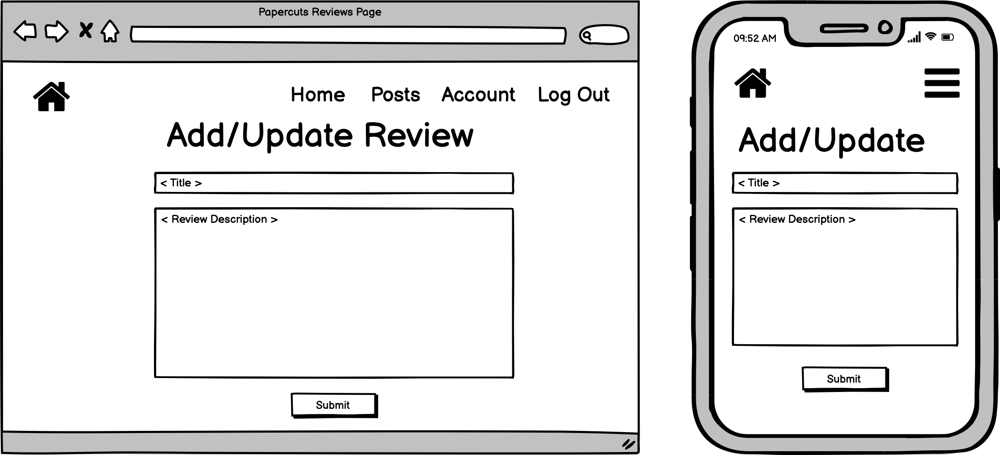
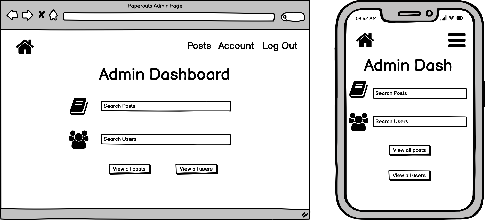
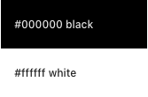

# Papercuts - Book Review Blog Project

"Papercuts" is a place user can view and read book reviews created by other readers. 
The user can also create and post their own book reviews. The live website can be viewed [here](https://papercuts-project.herokuapp.com/).

## Table of Contents

* [User Experience Design (UX)](#User-Experience-Design)
    * [The Strategy Plane](#The-Strategy-Plane)
        * [Site Goals](#Site-Goals)
        * [User stories](#User-Stories)
    * [The Scope Plane](#The-Scope-Plane)
    * [The Structure Plane](#The-Structure-Plane)
    * [The Skeleton Plane](#The-Skeleton-Plane)
        * [Wireframes](#Wireframes)
        * [Database Design](#Database-Design)
        * [Database Security](#Security)
    * [The Surface Plane](#The-Surface-Plane)
        * [Design](#Design)
            * [Colour Scheme](#Colour-Scheme)
            * [Typography](#Typography)
            * [Imagery](#Imagery)
    * [Differences to Wireframes](#Differences-to-Wireframes)
* [Features](#Features)
    * [Existing Features](#Existing-Features)
    * [Future Features](#Features-Left-to-Implement)
* [Technologies](#Technologies)
* [Testing](#Testing)
    * [Test Strategy](#Test-Strategy)
    * [Test Results](#Test-Results)
* [Deployment](#Deployment)
    * [Deployment to Heroku](#Project-Creation)
    * [GitHub Pages](#Deployment-To-Heroku)
    * [Local Clone](#Local-Clone)
    * [Fork Project](#Fork-Project)
* [Credits](#Credits)
  * [Content](#Content)
  * [Media](#Media)
  * [Code](#Code)
  * [Acknowledgements](#Acknowledgements)

****

## User Experience Design

### **The Strategy Plane**

- The user doesn't know what book they would like to read. Perhaps they know the genre they might like to read but 
they woudln't know exactly where to start. Alternatively, they might have just read a fantastic book and would like 
to share their opinions. Papercut is the site that will allow them to engage with other readers and 
share their personal reviews. 

- This website aims to allow the reader to quickly find book recommendations and create reviews on books they have 
read, reviews which can be seen by other users to help them make a decision on whether to read/purchase a certain 
book. All reviews are recorded and can be editted or deleted by their respective authors. The users can also add user statuses of which other user's can read.

#### Site Goals

- To bring together like-minded readers and allow them to express their views on a novel they enjoy or dislike.
- To help readers make a decision on what book they should read next.
- To allow readers to connect with other readers through their individual profiles.

#### User stories

- As a user, I immediately want to know the purpose as to why the site was made.
- As a user, I would like if the website were easy to navigate and that I never felt lost no matter where I was 
when exploring the website
- As a user, I want the website to be responsive, if I were to view it on mobile, tablet, laptop or desktop. I expect
its content to be clear and be positioned accordingly.
- As a user, I want to be able to return to the main site without having to use the browser buttons so 
that I can easily return to the website if I navigate to a page that doesn't exist.
- As a user, I want to be able to register an account to the website so I can post book reviews. I also want to
be able to edit and delete the reviews I created.
- As a user, I want to be able to edit and delete the profile I created.
- As a user, I want to be able to see the posts I created and the posts other users have created.
- As a user, I want to be able to search/filter book reviews on a custom genre or criteria as best suits me.

#### Admin

- As an admin I want all of the above options but I want to also be able to access and delete the reviews 
made by other users.
- As an admin I want to be able to create and delete review categories/genres.
- As an admin I want to be able to view how many users are registered on the website and delete users if 
necessary.

### **The Scope Plane**

**Features planned:**

- Responsive design.
- Website Title and purpose immediately communicated.
- Side Navigation Menu.
- MongoDB databases to store reviews information and users profiles.
- Login functionality.
- Logout functionality.
- CRUD functionality for posts and profiles.
- Book Titles and Genres displayed and searchable to all users.
- Registered user review creation and management.
- Registered Admin reviews and genres management.
- Admin dashboard for statistics and genre manipulations.

### **The Structure Plane**

#### User stories

User Story:
> As a user, I immediately want to know the purpose as to why the site was made.

Criteria:
- Site heading and Logo to be displayed on the main navigation bar on all pages.
- Site Logo hidden for mobile display.
- Home Page to display all necessary information and header image to the user regarding the purpose of the site.

Implementation:

A site logo with the website name will be displayed on the main navigation bar at the top of every page. 

A detailed description of the site accompanied by relevant imagery will be displayed on the Home page so that is evident of the websites purpose as soon as the user visits the site.

User Story:
> As a user, I would like if the website were easy to navigate and that I never felt lost no matter where I was 
when exploring the website

Criteria:
- Navigation menu to be displayed on all pages regardless of device or screen height/width.
- All navigation links direct the user to the appropriate pages.

Implementation:

A side navigation menu will be displayed through by clicking on the hamburger menu at the top the navigation bar. Clicking on the menu options will redirect the users to the appropriate pages. On mobile devices, the menu will be collapsible icon which can be clicked to show or hide the menu options.

The following main pages will be implemented:

- Base Page - base.html
- Sign Up Page - register.html
- Sign In Page - login.html
- Home page (Displays community posts) - index.html
    - Create Post Page - add_post.html
    - Edit Post Page (Edit button accessible from users profile) - edit_post.html
    - Delete Post Page (Delete Button accessible from users profile) - delete_post.html
    - Reviews Page - reviews.html
- Member Profile Page - profile.html
    - Edit User's Profile Page (Edit Status and Avatar) - edit_profile.html
- Admin Dashboard - dashboard.html
    - Edit Genre Page (Rename or Delete Genres) - edit_genre.html   
- Sign Out - sign-out.html (redirects users to home page)
- Error 404 - 404.html (error 404 handling)
- Error 500 - 500.html (error 500 handling)

User Story:
> As a user, I want the website to me responsive, if I were to view it on mobile, tablet, laptop or desktop. I expect
it's content to be clear and be position accordingly.

Criteria:
- Website content should be positioned appropriately. Horizontal scroll should not be present on smaller devices.

Implementation:

Materialize will be used to style the website's containers, grids and column sizes. Suitable sizes will be utlilised to portray content clearly regardless of the user's device. Images will be responsive, positioned and scaled down to ensure it fits the screen size approprately and will not obstruct any content.

User Story:
> As a user, I want to be able to return to the main site without having to use the browser buttons so 
that I can easily return to the website if I navigate to a page that doesn't exist.

Criteria:
- If a user redirects to the wrong page, an error will display that contains a link to go back to the main website.

Implementation:

A custom 404 page will be created to assist the user to return to the website's main page.

User Story:
> As a user, I want to be able to register an account to the website so I can post book reviews. I also want
to be able to edit and delete the reviews I created.

Criteria:
- Sign up - Login and Logout functionality will be available.
- Users will be able to create, update and delete their own profiles.
- Users will be able to create, update and delete their own posts.
- Users will have a profile page displaying their status and avatar.
- Only the creator and Admin have the ability to update or delete the creator's post.

Implementation:

Users will be able to register an account on the website via a Sign Up page. They are then required to create a username and password. This account will set up a profile for the user with a default profile image which shall be stored in MongoDb under the 'users' collection.

Once an account has been established for the user, they can then post reviews. They will be allowed to edit or delete theie own posts. Only the author of the review will be able to update or delete their post so as to avoid unwanted modifications. Flash messages will be present to inform the user of any changes.

User Story:
> As a user, I want to be able to edit and delete the profile I created.

Criteria:
- The user will be able to update their status as well as their avatar.
- If the user wishes, they can delete their profile and delete the reviews associated with it.

Implementation:

When the user goes to update/edit their profile information. There will be an option to delete their account. Before account deletion continues, the user will be asked if this is truly what they desire. 

User Story:
> As a user, I want to be able to see the posts I created and the posts other users have created.

Criteria:
- The user should be able to research and read the reviews of other users as well as their own. 
- The user should be able to find their posts if they go to their profiles.
- The user should be able to read other users' posts if they research their profile.

User Story:
> As a user, I want to be able to search/filter book reviews on a custom genre or criteria as best suits me.

Criteria:
- A search box will assist the user with finding certain reviews based on genres, titles, content, date or its author.
- Search results will be sorted in descending order based on the date of creation.

Implementation:

A search box is present on the website to allow users to search for dates, authors, title and contents of books. This will then display the review results for that query. This will be implemented by using a database index that will be created on the MongoDB collection 'posts'.

#### Admin User Stories

User Story:
> As an admin I want all of the above options but I would also be able to access and delete all the reviews 
from other users.

Criteria:
- The admin will have the power to edit or delete reviews when necessary e.g. when a user's post does not follow 
community guidelines.

Implementation:

An administrator's dashboard will be implemented in the website. This will be available to the admin when they log in.
The dashboard will have all of the user's functionality and will also have free reign on editting or deleting a user's 
posts.

User Story:
> As an admin of Papercuts I want to be able to create, edit and delete review categories/genres.

Criteria:
- The admin will have the ability to create, edit or delete review genres and the contents within each genre.

Implementation:

The administrator's dashboard will have the functionality to add, edit or delete genres via add_genre.html and
edit_genre.html. Deleting the Genre will also delete the posts for that Genre.

User Story:
> As an admin of Papercuts I want to be able to view how many users are registered on the website and delete users
if necessary.

Criteria:
- The Admin Dashboard displays the number of users registered on the website. 
- The Admin has the power to delete a user when necessary e.g. if user breaks community guidelines

Implementation:

The administrator's dashboard will have the functionality to view a user's profile details and posts when researching their account. The admin will can see and use the same buttons the user interacts with to edit or delete their post.

### **The Skeleton Plane**
#### Wireframes

- Main/Home Page: <br>
<br>

- Register: <br>


- Log In: <br>
 

- Profile: <br>


- Update Profile: <br>


- Latest Posts: <br>


- Add Post: <br>


- Admin: <br>


#### Database Design (MongoDb)

Sample Object Format:

**Collection: genres**<br>

{<br>
&nbsp;&nbsp;&nbsp;&nbsp;_id: <em>unique value</em>,<br>
&nbsp;&nbsp;&nbsp;&nbsp;genre_name: "Adventure"<br>
}

**Collection: posts**<br>

{<br>
&nbsp;&nbsp;&nbsp;&nbsp;_id: <em>unique value</em>,<br>
&nbsp;&nbsp;&nbsp;&nbsp;genre_id: <em>(genre)unique value</em>,<br>
&nbsp;&nbsp;&nbsp;&nbsp;post_title: "The best new Thriller",<br>
&nbsp;&nbsp;&nbsp;&nbsp;book: "Sixteen Horses by Greg Buchanan",<br>
&nbsp;&nbsp;&nbsp;&nbsp;review: "Near the dying English seaside town of Ilmarsh, local police detective...",<br>
&nbsp;&nbsp;&nbsp;&nbsp;date: "28 April, 2021",<br>
&nbsp;&nbsp;&nbsp;&nbsp;created_by: <em>unique username</em><br>
}

**Collection: users**<br>

{<br>
&nbsp;&nbsp;&nbsp;&nbsp;_id: <em>unique value</em>,<br>
&nbsp;&nbsp;&nbsp;&nbsp;username: <em>unique username</em>,<br>
&nbsp;&nbsp;&nbsp;&nbsp;password: <em>unique hashed password</em>,<br>
&nbsp;&nbsp;&nbsp;&nbsp;avatar: "https://gravatar.com/avatar/dfd40517948bc137cfff2c6de1db27cc?s=400&d=r...",<br>
&nbsp;&nbsp;&nbsp;&nbsp;status: "Im doing fantastic!",<br>
}

#### Database Security

Database security is maintained through the "env.py" file which ensures that the configuration files are not stored in github via .gitignore. For production, the configuration details are placed into the app settings within Heroku.

### **The Surface Plane**
### Design

#### Colour Scheme

The main website color is orange:<br>

Text colors derive from materialize css white-text, black-text and saddle brown. These colors were used interchangeably depending on the background color used: 
<br>

<br>


The base color is the 'old lace' and wheat, variations of white color:<br>

<br>


#### Typography

The main typography used for the website was the font named "Benne". This font was accessed through Google fonts. 

#### Imagery

All images used within the website were all taken from [unsplash](https://unsplash.com/).

## Differences to Wireframes

- The main homepage/main page was part of the original design, however, I thought it would be best if users could visit the website and get straight into reading posts regardless if they had an account or not. This would allow for newcomers to discern and explore what the website was about.

- The registration page originally two input fields for the password and a second one to confirm the original password. This is something I seek to implement in the future.

- Originally, it was desired that the user could update their profile images with their preferred pictures. At the moment the website creates a drop down list of which the user can choose an avatar for their profile. User image uploads is a feature I would like to implement into this website in the future.

- The option to change the user's email address on the profile has been removed. Instead the user can only edit their profile status and posts. I did this to avoid confusion between user's, in order to make finding author's posts easier and maintain account security.

- The Admin Dashboard has been altered immensely. Every user now has the search feature available at the top navigation bar. Instead, the dashboard will display the number of posts and the number of users registered on the website. It will also allow the admin to edit or delete genres as he/she pleases.

****
## Features

### Existing Features

- Home page which displays the most recent 25 posts within the community and portrays the website's purpose.
- Registration feature which allows users to sign up and create an account.
- Log in Feature which allows users to sign into their account.
- Search functionality which is on every page in the website as long as the user is signed in.
- Genre search functionality which allows users to search for posts based on the post genre.
- Profile page which shows logged in user's username, status and posts. Displays other profile's usernames and status.
- Posts modification - the website allows content creators to create, edit or delete profiles and posts they have created.
- Mobile responsiveness.
- Side Navigation bar which can be toggled on and off through the hamburger menu.
- Admin dashboard which allows the admin to view website statistics and manipulate genres.

### Features Left to Implement

A feature I would like to implement in the near future is to allow users to upload their own profile pictures.

Another feature I would like to add is on the registration page. An authenticator which confirms the user's desired password via a second input field which reads if both passwords match.

A feature I would like to work on in the future is the ability to like another user's post, perhaps sort reviews according to the most liked post.

****
## Technologies

- [HTML](https://en.wikipedia.org/wiki/HTML)
    - The website incorporates HTML as the base structure for the pages.

- [CSS](https://en.wikipedia.org/wiki/CSS)
    - The project uses CSS to style and design the website.

- [Materialize](https://materializecss.com/) 
    - Materialize was used for website design and website responsiveness.

- [jQuery](https://jquery.com/)
    - Materialize Modals
    - Materialize Side Nav
    - Materialize Text Area character counter
    - Materialize Form Select 
    - Materialize Tooltips
    - Website Copyright
    - Navigation bar scrolling interactivity
    - Validation for materialize inputs

- [Python](https://www.python.org/)
    - Python was used to create and run the back-end logic of the website.
    - Python modules used (as stated in requirements.txt):
        - click==7.1.2
        - dnspython==2.1.0
        - Flask==1.1.2
        - flask-paginate==0.8.1
        - Flask-PyMongo==2.3.0
        - itsdangerous==1.1.0
        - pymongo==3.11.3
        - Werkzeug==1.0.1 

- [MongoDB](https://www.mongodb.com/2)
    - MongoDB is a non-relational database used to create document based collections. This was used to store the data inputs made through the website.

- [Google Fonts](https://fonts.google.com/)
    - Google Fonts was used throughout the website, mainly the font "Syne".

- [Google Chrome Developer Tools](https://developers.google.com/web/tools/chrome-devtools)
    - This was used to inspect the website and help debug styling issues and test for grid layouts.

- [GitHub](https://github.com/)
    - This was used to store the scource code for the website.

- [Git](https://git-scm.com/)
    - Git was used for version control during development where code was committed and pushed to the project's Github repository.

- [Heroku](https://dashboard.heroku.com/apps)
    - This was used to deploy the live website.

- [Balsamiq Wireframes](https://balsamiq.com/wireframes/)
    - This was used to create wireframes prior to the project having been developed.

- [TinyPNG](https://tinypng.com/)
    - This was used to reduce the file sizes of the images used in the project.

****
## Testing

### Test Strategy
#### **Summary**
Testing is to be made to ensure all features of the website is working as intended and that the links lead to the appropriate pages. Tests must be made to judge the websites responsiveness. Additionally, that all inputs done through the forms will submit the data to the appropriate collections. It is also there to ensure the project's code structure abides the universal best practices for programming. 

HTML Code must pass through the [W3C HTML Validator](https://validator.w3.org/#validate_by_uri).

CSS Code must pass through the [W3C CSS Validator](https://jigsaw.w3.org/css-validator/).

JavaScript code must pass through the [JSHint Validator](https://jshint.com/).

Python Code must pass through [PEP8 Validator](http://pep8online.com/)

### Test Results

Test Results are documented [here](TESTING.md)

## Deployment

### Project Creation

- Project started using Github and Gitpod.

1. First I signed into Github and created a new repository. There will be a drop down menu when looking to use a template
    so I chose to use Code Institute's Template. Alternatively, you can navigate [here](https://github.com/Code-Institute-Org/gitpod-full-template)
    and there will be an option button called "Use this template".

2. I then clicked the use this template button. Where I was directed to create a new repository name and create a new 
    repository which I could open using Gitpod.

3. It creates a Gitpod workspace of which I could start developing the project.

### Local Deployment

To deploy the project locally, the following commands were used:

1. In the terminal, type "pip3 install Flask" which sets up flask and allows imports.

2. In terminal, the developer then types in "touch app.py" or create a new file and name it "app.py". This is where the applications funcationality derives from.

3. We will be storing some sensitive information for local deployment, hence an "env.py" file must be created.

4. Open a ".gitignore" file and type "env.py" as well as "__pycache__/" in this .gitignore file.

5. Type "import os" within the "env.py" file in order to set default envrionment variables.

- The IP variable is set to "0.0.0.0" - (os.environ.setdefault("IP", "0.0.0.0"))
- The PORT is set to "5000" - os.environ.setdefault("PORT", "5000")
- SECRET_KEY is set to the developers own generated secret key - os.environ.setdefault("SECRET_KEY", "#SECRET_KEY")
- MongoDB name is set to the database name created by the developer - os.environ.setdefault("MONGO_DBNAME", "#DbName")
- Mongo URI is provided by MongoDB upon creation of a Database and is used for Database connection - os.environ.setdefault("MONGO_URI", "#ProvidedMongoURI")

### Version Control 

In the terminal, I utilised the following commands in the following order:

- git add . (git add <em>filename</em>) - command to add all files or a specific file 
- git commit -m <em>commit message</em> - command to commit the changes locally with a message to describe the changes briefly
- git push - command to push changes to remote Github repository

### Deployment to Heroku
**Create application:**

1. I signed into Heroku 
2. I created a new app by clicking the "new" button.
3. Select the new app 
4. Create an app project name 
5. Selected Europe as the region

**Set up connection to Github Repository:**

1. A requirements.txt needs to be created, this can be done through the following terminal command
    >  pip3 freeze --local > requirements.txt

2. Then a Procfile for Heroku is needs to be created, here is the terminal command used
    >  echo web: python app.py > Procfile

3. Ensure there the Procfile begins with a capital letter 'P' and that there are no unecessary spaces 

4. Click the deploy tab and select Github - connect to Github

5. There will be an empty input field where you can type the name of your repository. Write the repo name there and 
    click search

6. Once the repository has been found, click the connect button

**Set environment variables:**

- Click the settings button at the top of the page
- There will be an option titled 'Reveal Config Vars' - click on this 
- Here, you can add your config variable keys from your `env.py` file

<strong>Example:</strong>

- key: IP, value: 0.0.0.0
- key: PORT, value: 5000
- key: MONGO_DBNAME, value: (<em>Database name you wish to connect to</em>)
- key: MONGO_URI, value: (<em>Mongo URI - This can be found in MongoDB by going to clusters > connect > connect to your application and substituting the password and dbname that you set up in the link</em>).
- key: SECRET_KEY, value: (<em>Custom Secret Key</em>).

**Enable Automatic Deployment & Manual Deployment:**

- Ensure your Procfile and requirements.txt are in your repository as Heroku will not be able to deploy without these
- Click the Deploy tab
- Click Enable Automatic deploys in 'Automatic Deploys' section
- Choose the branch you would like to deploy and click "Deploy Branch"

### Local Clone

**Note: To run this project locally, an "env.py" file must be created for configuring IP, PORT, MONGO_URI, MONGO_DBNAME and SECRET_KEY. These details are private and not disclosed in this repository for security purposes.**

This is used when you would like to make changes to the project code

1. Should you wish to use a different IDE like VSCode. You first log in to Github and locate the required repository. Here is the link for this [repository](https://github.com/wyne-ybanez/PaperCut)
2. Open a new terminal on Git Bash
3. Type `git clone`, and then paste the URL you copied 

```
$ git clone https://github.com/wyne-ybanez/PaperCut
```

 Here is a link that can explain this process further. [Click Here](https://help.github.com/en/github/creating-cloning-and-archiving-repositories/cloning-a-repository#cloning-a-repository-to-github-desktop)

### Fork Project 

You can fork the repository through the following steps. Forking the repository means you will have a copy of the repository and any changes you make will not affect the original repository.

1. Log in to GitHub and locate the GitHub Repository. Here is a link for the [repository](https://github.com/wyne-ybanez/PaperCut)
2. At the top of the Repository (not top of page) just above the "Settings" Button on the menu. Looking towards the right of the page. Locate the button "Fork" then click 
3. You should now have a copy of the original repository in your GitHub account

****
## Credits

### Content

- Game of thrones filler content used by "Allen" profile - [link](https://en.wikipedia.org/wiki/Game_of_Thrones)
- Hidden life of Trees filler content used by "Wyne" Profile - [link](https://www.goodreads.com/book/show/28256439-the-hidden-life-of-trees#:~:text=Drawing%20on%20groundbreaking%20new%20discoveries,in%20the%20forest%20around%20him.)
- Sixteen Horses by Greg Buchanan filler content used by "Wyne" profile - [link](https://www.waterstones.com/book/sixteen-horses/greg-buchanan/2928377056148)
- Daisy-McG's ReadMe.md file contents and structure was adopted and used to restructure my own README.md. - [link](https://github.com/Daisy-McG/Motorbike-Event-Finder/blob/main/README.md)

### Media 

- Avatars used for website from avatar generator - [link](https://vinicius73.github.io/gravatar-url-generator/#/)
- Unsplash for genre images and header image - [link](https://unsplash.com/)

### Code

- CSS preload animation fix - [link](https://css-tricks.com/transitions-only-after-page-load/)
- How to format dates - [link](https://stackabuse.com/how-to-format-dates-in-python/)
- Validation code for Code Institute - [link](https://github.com/Code-Institute-Solutions/TaskManagerAuth/blob/main/04-AddingATask-WritingToTheDatabase/02-materialize-select-validation/static/js/script.js)
- Stackoverflow solution for changing text area height - [link](https://stackoverflow.com/questions/52452763/materialize-textarea-tag-is-not-scrollable-on-fixed-height/52454652)
- Mongodb count number of users/posts - [link](https://docs.mongodb.com/manual/reference/method/db.collection.countDocuments/)
- Scroll effect - [link](https://stackoverflow.com/questions/29646622/set-bootstrap-navbar-transparency-on-scroll)
- Header image - Start Bootstrap, Clean Blog v5.0.10 - [link](https://startbootstrap.com/theme/clean-blog)
- Changing select drop down menu color - [link](https://www.javaer101.com/en/article/2794917.html)
- Preserve text area prewrap - [link](https://stackoverflow.com/questions/40417527/how-do-i-preserve-line-breaks-when-getting-text-from-a-textarea/40426477)
- Text overlapping container solution - [link](https://stackoverflow.com/questions/50819817/materialize-text-overlapping-div)
- Avatar styling - [link](https://www.w3schools.com/howto/howto_css_image_avatar.asp)
- Brown Main color theme of the website - [link](https://www.rapidtables.com/web/color/brown-color.html) 
- Base background color - [link](https://www.rapidtables.com/web/color/white-color.html)
- Code Institute's Tutor Johan for accessing ‘genre_name’ from genres collection and attaching appropriate data to 'genre_id' field in the 'posts' collection.
- Error handlers through flask documentation - [link](https://flask.palletsprojects.com/en/1.1.x/patterns/errorpages/)

### Acknowledgements

I would to express my gratitude to the Code Institute tutor's and community for helping get this far.

I would like to thank my mentor Dick Vlaanderen for his wisdom and advice during the development of the project.

I would like to thank the Code Institute tutor Johan for his help on the "genre_name" bug.

I would like to give credit to Daisy, a Code Institute Student who's README.md document inspired and assisted in the structure and contents of my own README.md file.

I would like to give credit to Brian Whelan, a Code Institute Student who's project inspired the overall website structure and features.


