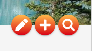
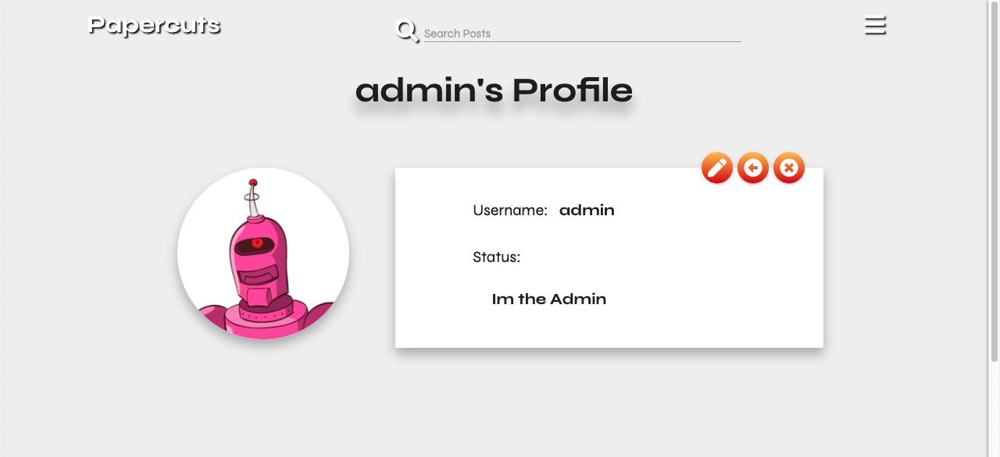
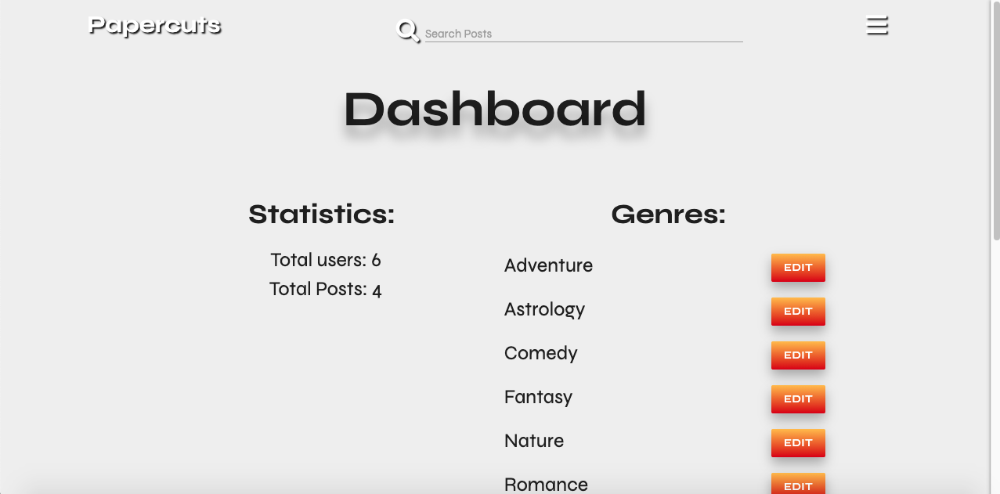
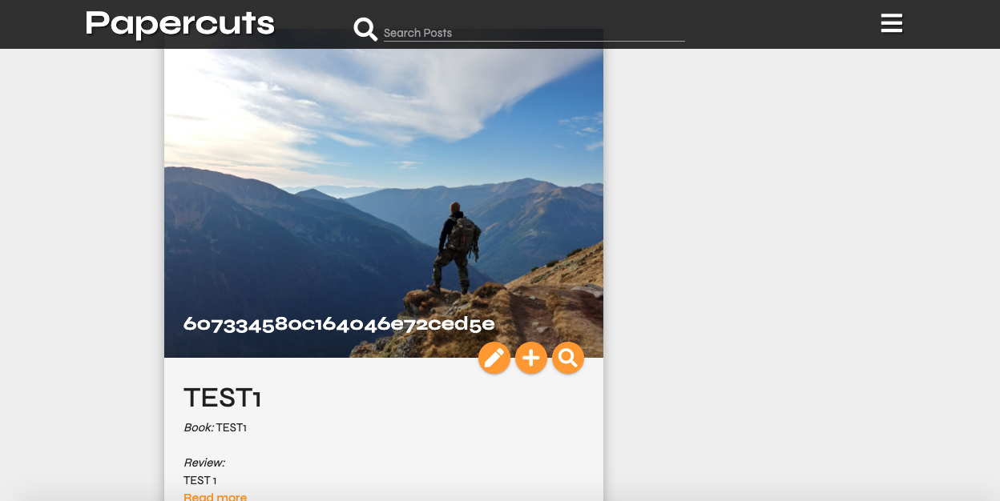
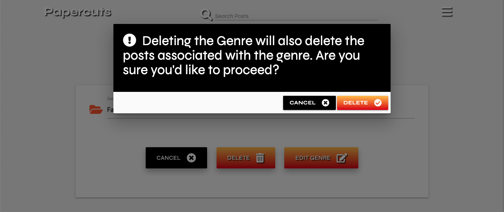

# Testing

* [User Stories](#user-stories)
* [Bugs during development.](#tests-and-bugs-during-development)
* [Validators](#validators)
    * [HTML](#html)
    * [CSS](#css)
    * [Javascript](#javascript)
    * [Python](#python)
* [Known bugs](#known-bugs)

****

## User Stories

#### User stories

User Story:
> As a user, I immediately want to know the purpose as to why the site was made.

- Opening the website navigates the user to the [main page.](https://papercuts-project.herokuapp.com/)
- Masthead with image of a man reading 
- Text displayed to communicate the purpose of the site.

User Story:
> As a user, I would like if the website were easy to navigate and that I never felt lost no matter where I was 
when exploring the website

- Hamburger Menu is always present at the top navigation bar no matter what page the user visits.
- Every page has a heading/subheading to communicate what page the user has visited.
- All content shown on the pages are relevant to the links established to access them.

User Story: 
> As a user, I want the website to be responsive, if I were to view it on mobile, tablet, laptop or desktop. I expect
its content to be clear and be positioned accordingly.

- Website tested on mobile - website responds accordingly and lay out is clear.
- Website tested on laptop - website responds accordingly and lay out is clear.
- Website tested on iPad and iPad pro - website responds accordingly and lay out is clear.

User Story: 
> As a user, I want to be able to return to the main site without having to use the browser buttons so that I can easily return to the website if I navigate to a page that doesn't exist.

- Both Error 404(URL not Found) and Error 500(Internal Server Error )have dedicated pages to handle the errors should they arise.
- These error pages have a button which allows the user to return to the home page.


User Story: 
> As a user, I want to be able to register an account to the website so I can post book reviews. I also want to be able to edit and delete the reviews I created.

- Users can register an account through register.html
- Users can add a post through the "add post" option in the side navbar menu
- Users can also add a post through the action "plus" button on card posts or through the "plus" button in review.html
- Users can edit posts should the action button be available for them - they are always able to edit their own posts. This can be done through the button with the "pen" icon.
- Users can delete posts they created through the 'delete' option at the bottom of every post or by clicking on the button with the "trash" icon.



User Story: 
> As a user, I want to be able to see the posts I created and the posts other users have created.

- Once a user has signed in, the posts they've created will be displayed in profile.html
- The user can access this through the side navigation menu.
- The user can also go to index.html and click on the profile name within the posts to be redirected to author's profile and see their posts.

User Story: 
> As a user, I want to be able to edit and delete the profile I created.

- Edit their profiles through edit_profile.html - accessed through the button with the "pen" icon.
- They will be able to determine their avatar and status description through this page.
- They can delete a profile as long as they are the admin or the profile belongs to them. This can be done through the button with the "X" icon.



User Story: 
> As a user, I want to be able to search/filter book reviews on a custom genre or criteria as best suits me.

- As long as the user has signed in, there is always a search input field at the top navigation bar.
- This search input field queries for a text and finds a relating post for that text input.
- Genres are searched through the main page where there is a drop down menu to search for posts within a specific genre.

#### Admin User stories

User Story:
> As an admin I want all of the above options but I want to also be able to access and delete the reviews made by other users.

- The admin can add posts just like other users.
- The admin has permissions to read and delete posts made by other users.
- The admin cannot edit another user's post.
- The admin has his/her own dedicated profile.

User Story:
> As an admin I want to be able to create and delete review categories/genres.

- The admin has permissions to manipulate and delete genres
- The admin can access the dashboard(dashboard.html) anytime through the side navigation menu. Here they can add a new genre.
- If the admin deletes a genre, it also deletes posts within that genre.

User Story:
> As an admin I want to be able to view how many users are registered on the website and delete users if necessary.

- The admin has the power to delete user accounts from the site if he/she visits their profile.
- The admin can view the amount of users registered on the site in dashboard.html



****

## Bugs during development

### Text-Wrap Bug

Description:<br>
When the user wanted to add a paragraph or a line break to their post, materialize css would ignore this and automatically format the text into one continuos long text. Without line breaks the content of the posts were too much to digest and just seemed unappealing overall for the user. 

Solution: 
```
.card-content .container p {
    white-space: pre-wrap;
}
```

[Stack Overflow Link](https://stackoverflow.com/questions/40417527/how-do-i-preserve-line-breaks-when-getting-text-from-a-textarea/40426477)

### Break-Word Bug

Description: <br>
When the user wanted to edit their reviews or their profile status, at times the text would not remain inside their containers and would instead continue across the page. 

Solution:
```
.break-word {
  word-wrap: break-word;
}
```

[Stack Overflow Link](https://stackoverflow.com/questions/50819817/materialize-text-overlapping-div)

### Genre_name bug

Description:<br>
I wanted to display the genre names of which the posts were assigned to. I initally began the project by assigning a post with a genre name for that particular post. However, this has now been altered, now a post will take in the '_id' value of a genre. This method allows the admin to change the genre name not only for one post, but for multiple posts with that genre. 

The difficulty was that while the genre was assigned, it showed the genre ID rather than the genre name. 



Solution:
```
for post in posts:
        genre_name = mongo.db.genres.find_one(
            {"_id": ObjectId(post["genre_id"])})["genre_name"]
        post['genre_name'] = genre_name  
```

### Delete Genre Modal bug

Description:<br>
The page dashboard.html displayed all the genres that were available on the website. Initially, beside every genre, were two option buttons. One to edit the genre, and one to delete. When requesting to delete a genre, I wanted a modal to appear as a method of defensive programming. 

The issue was, once the admin clicks the button to approve, this delete the first genre on the list and not the specified genre. This was due to the function requiring a 'genre_id'. However, the modal could not determine the desired genre_id to delete.

Solution:
- I removed the 'DELETE' genre button from the Admin Dashboard
- Instead I placed this button and its designated modal in edit_genre.html



### Search Profile bug

Description:<br>
Initially the website was aimed at viewing user's profiles through the main page and its posts, however, at the time there was no function created for this purpose. 

When viewing another user's profile it would immediately view the session user's profile instead.

I created another function to assist with this feature.

Solution:
```
@app.route('/search_profile/<user_id>', methods=['GET', 'POST'])
def search_profile(user_id):
    '''
    Researching user and see
    their status and posts.
    '''
    user = mongo.db.users.find_one({'_id': ObjectId(user_id)})
    posts = list(mongo.db.posts.find({'created_by': user['username']}))

    return render_template("profile.html", user=user, posts=posts)
```

#### Validators

W3C HTML Validator [Results](https://validator.w3.org/nu/?doc=http%3A%2F%2Fpapercuts-project.herokuapp.com%2Fget_posts)

W3C CSS Validator [Results](https://jigsaw.w3.org/css-validator/validator?uri=http%3A%2F%2Fpapercuts-project.herokuapp.com%2Fget_posts&profile=css3svg&usermedium=all&warning=1&vextwarning=&lang=en)

PEP8 Validator [Result](readme_Img/pep8.png)

JSHint Validator [Result](readme_Img/JsHint.png)

#### Known Bugs

Deleting a user as the admin does not delete the user's posts, this is something I have not found a solution for as of yet and would like to fix in the future.

